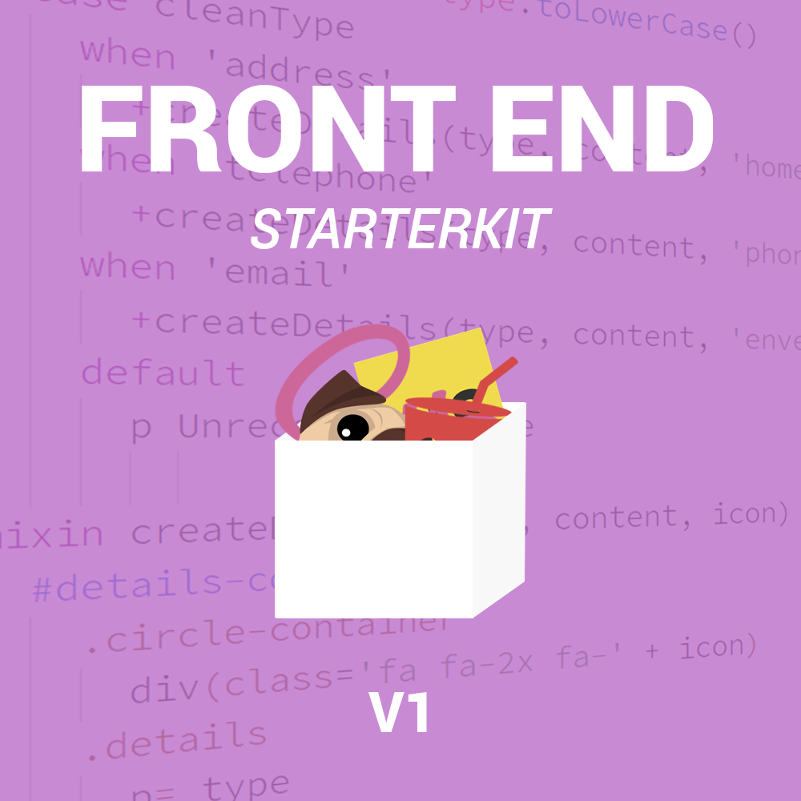

# Front End Starterkit - V1

A starter kit to help you get your next client-side project off the ground!



## Overview

The purpose of this repository is to provide you as a developer with
and integrated workflow when embarking upon projects which involve predominantly front end development. Within this repository there are several tools which help aid developmental processes, most notably gulp. Gulp is used to streamline the build process and essentially transform source code into optimized distribution code.

The technologies included within this starterkit are: pug, sass, js/jquery and gulp. For those of you who are unfamiliar with any of the technologies used, but are keen to learn, I have compiled a collection of introductory resources for you:

- Pug: [Official website][1], [beginners syntax tutorial][2], [advanced features (with a funny pug life image 😄)][3]
- Sass: [Official website][4], [beginners syntax tutorial][5], [pre-built resources][6]
- JS: [W3schools][7], [mozilla][8], [codecademy][9]
- JQuery: [Official website][10], [w3schools][11], [interactive web dev book][12]
- Gulp: [Official website][13], [beginners guide][14]

In addition to these resources, these youtube channels are fantastic: [Devtips][15], [learn code][16], [traversy media][17]

## System Requirements

To make use of this starterkit, you will need to have node installed on your local machine. To do this head over to [nodejs.org][18] and follow through the installation process.

Once node is installed, open up your terminal and run the following command to install gulp globally on your machine.

`npm install -g gulp`

This installation will give you access to gulp's cli for running our automation tasks such as `gulp sass`, which enables you to convert sass code into optimized css code, but more on that later!

## Installation

To install the starterkit for use within your next project you can either [download the project as a zip file][19], or clone the repository via https or ssh using your preferred terminal.

For cloning via https **(most simple solution)**, use your command line to navigate to your preferred directory (may I suggest Documents?) and run the following command:

`git clone https://github.com/matthew678532/front-end-starterkit.git`

For cloning via ssh **(more advanced, but also more secure)**, you need to generate an ssh key on your local computer and share this with github. To do this follow [these guidelines][20]. When you've setup your ssh key, run the following command:

`git clone git@github.com:matthew678532/front-end-starterkit.git`

Upon completion of any of the options above, you will have access to the source code locally on your machine. Before you start coding, and using the features prepared within the source code, you will need to download the packages stored within the package.json file. To do this you will need to cd into the project directory and run the following command:

`npm install`

This will install all of the dependencies required to run the gulp commands, and completes the installation process.

## Usage

The core purpose in providing you with a starterkit is to enable you as the developer to work efficiently. The tooling which enables this is gulp, and this section highlights all the features available to you.

In essence, the gulpfile.js file found within the root directory contains tasks which enable you to automate many common development processes such as spinning up a web server, compiling sass to css or concatenating js modules.

Tasks can be accessed individually using a `gulp taskname` syntax in the terminal when located within the root directory. The tasks included within this project are:

| Name | Command | Details |
| ---- | ------- | ------- |
| pug | `gulp pug` | compiles pug files to html.
| sass | `gulp sass` | compiles sass files to css, includes minification, and prefixing.
| js | `gulp js` | compile JS/JQuery modules, includes minification and concatenation.
| image | `gulp image` | optimizes image assets implicitly (the image type is irrelevant).
| browsersync | `gulp browsersync` | launches a livereload server.
| build | `gulp build` | builds the project by running pug, sass, js and image tasks succinctly, outputting a /dist folder containing compiled code.
| clean | `gulp clean` | cleans the distribution folder for rebuilding the project.

In addition to build tasks, when developing code, you will want to ensure existing code doesn't break! Enter watchers. Watchers allow you to continuously watch code for any changes you make during development, and inform you of these changes in real-time.

To use the watcher open up the terminal and type `gulp watch`.

Although tasks and watchers have purposeful uses, the real power of gulp is tying tasks and watchers together to build flawless workflows.

To run tasks and watchers together, simply run `gulp` with no parameters. This will use the gulp default task which is setup to enable full reload/rebuild capabilities upon changes to code.

## Folder Structure

The folder structure used is fairly simple to get to grips with, and consists of two key directories, notably `src/` and `dist/`. The `src/` directory is of most importance however, and is where you will be writing your code. As you write your code you should run gulp in the background, this will automatically compile your source code into distribution code upon save, and thus populate your `dist/` folder with optimized code.

I have left a small description by each folder/file to describe its purpose for your reference, enjoy!

``` javascript

front-end-starterkit = {
	dist/: `Contains optimized files (don't edit this!)`,
	node_modules/: `Stores project dependencies`,
	src/: [`Contains source code/assets (get to work here!)`, {
		assets/: [`Contains assets (css, img, js)`, {
			css/: [`Contains sass files`, {
				1-tools/: [`Contains external resources for sass development`, {
					bourbon/: 'A 3rd party mixin library',
					_fonts.scss: 'Sass file to import fonts from services',
					_normalize.scss: 'CSS Reset file to normalize css behaviour across browsers'
				}],
				2-base/: [`Contains base styles for your project`, {
					_base.sass: 'Contains base styles, barebone element styles and resets',
					_mixins.sass: 'Contains functions to dry up sass code',
					_placeholders.sass: 'Contains placeholders for regular chunks of sass code',
					_variables.sass: 'Contains static variables for reusable code'
				}],
				3-modules/: [`Folder to store sass modules`, {
					_buttons.sass: 'Contains all code used to styles button elements',
					_header.sass: 'Contains all code used to style the header'
				}],
				4-pages/: [`Folder to store page specific styles`, {
					_index.sass: 'Contains styles created specifically for the index page'
				}]
			}],
			img/: [`Folder to store img assets used in the website`, {
				starterkit-logo.png: 'Sample image of the starterkit logo'
			}],
			js/: [`Folder to store javascript files`, {
				modules/: [`Folder to store javascript modules`, {
					example.js: 'An example javascript module'
				}],
				main.js: 'The calling file, where module methods/properties are invoked'
			}]
		}],
		pug/: [`Folder to store all pug files`, {
			modules/: [`Folder to store pug modules`, {
				header.pug: 'An example pug module to store header markup'
			}],
			index.pug: 'Contains markup used to define the index page',
			layout.pug: 'Contains the usual semantics required to create a html file'
		}]
	}],
	.gitignore: 'A file which includes folders/files to ignore when pushing to github',
	config.js: 'Contains configuration options such as folder structure data',
	gulpfile.js: 'Contains gulp tasks and watchers for automating development tasks',
	package.json: 'Project package for managing dependencies, and documenting your project',
	README.md: 'Project readme file, used to document your project'
}

```

## Authors

Matthew Birch

## Licensing

This is free and unencumbered software released into the public domain.

Anyone is free to copy, modify, publish, use, compile, sell, or
distribute this software, either in source code form or as a compiled
binary, for any purpose, commercial or non-commercial, and by any
means.

In jurisdictions that recognize copyright laws, the author or authors
of this software dedicate any and all copyright interest in the
software to the public domain. We make this dedication for the benefit
of the public at large and to the detriment of our heirs and
successors. We intend this dedication to be an overt act of
relinquishment in perpetuity of all present and future rights to this
software under copyright law.

THE SOFTWARE IS PROVIDED "AS IS", WITHOUT WARRANTY OF ANY KIND,
EXPRESS OR IMPLIED, INCLUDING BUT NOT LIMITED TO THE WARRANTIES OF
MERCHANTABILITY, FITNESS FOR A PARTICULAR PURPOSE AND NONINFRINGEMENT.
IN NO EVENT SHALL THE AUTHORS BE LIABLE FOR ANY CLAIM, DAMAGES OR
OTHER LIABILITY, WHETHER IN AN ACTION OF CONTRACT, TORT OR OTHERWISE,
ARISING FROM, OUT OF OR IN CONNECTION WITH THE SOFTWARE OR THE USE OR
OTHER DEALINGS IN THE SOFTWARE.

For more information, please refer to [https://unlicense.org][21]


[1]: https://pugjs.org/api/getting-started.html
[2]: https://www.sitepoint.com/jade-tutorial-for-beginners/
[3]: https://medium.com/@antonioregadas/getting-started-with-pug-template-engine-e49cfa291e33
[4]: http://sass-lang.com/
[5]: https://scotch.io/tutorials/getting-started-with-sass
[6]: https://sassisfaction.com/
[7]: https://www.w3schools.com/Js/
[8]: https://developer.mozilla.org/en-US/docs/Learn/Getting_started_with_the_web/JavaScript_basics
[9]: https://www.codecademy.com/learn/introduction-to-javascript
[10]: https://jquery.com/
[11]: https://www.w3schools.com/JQuery/
[12]: http://javascriptbook.com/
[13]: https://gulpjs.com/
[14]: https://css-tricks.com/gulp-for-beginners/
[15]: https://www.youtube.com/user/DevTipsForDesigners
[16]: https://www.youtube.com/channel/UCVTlvUkGslCV_h-nSAId8Sw
[17]: https://www.youtube.com/user/TechGuyWeb
[18]: https://nodejs.org/en/
[19]: https://github.com/matthew678532/front-end-starterkit/archive/master.zip
[20]: https://help.github.com/articles/connecting-to-github-with-ssh/
[21]: https://unlicense.org
